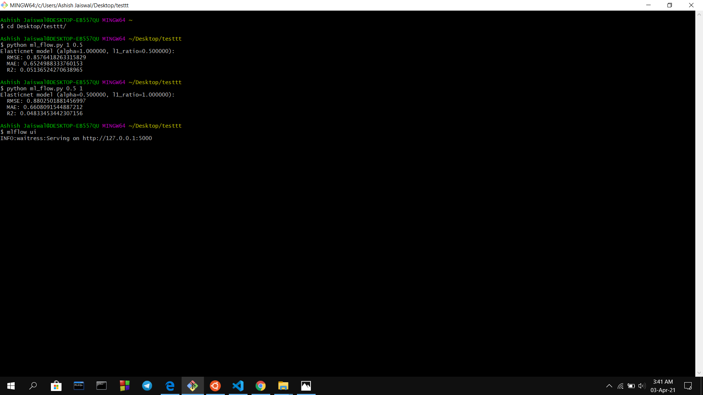
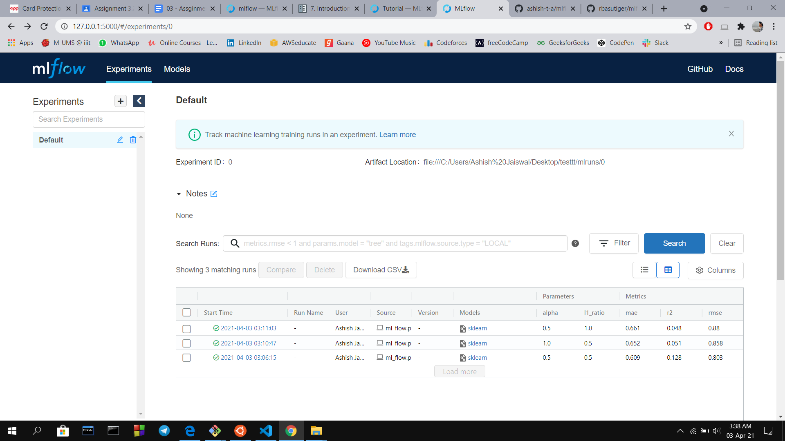

# mlflow_testing

## To run mlflow ui

`python mlflowtest.py`

`mlflow ui `

## Re-run with new values of alpha and l1 ratio

`python mlflowtest.py <new_alpha_value> <new_l1_ratio> `

## Screenshots

